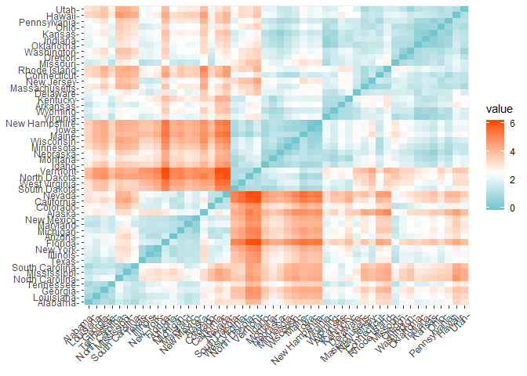
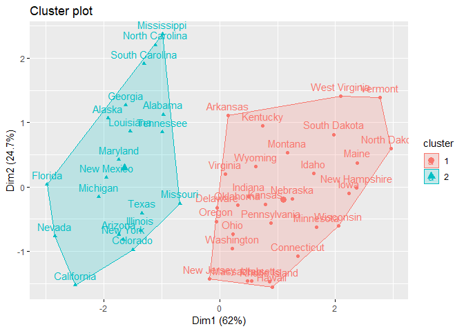
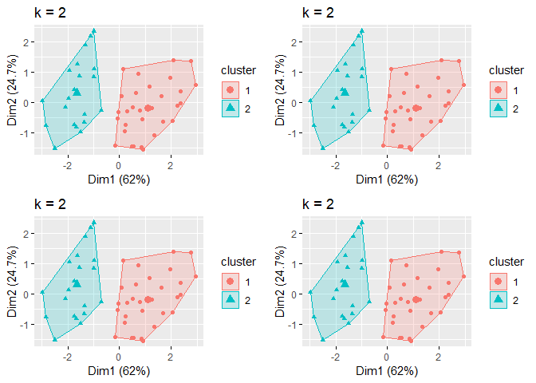
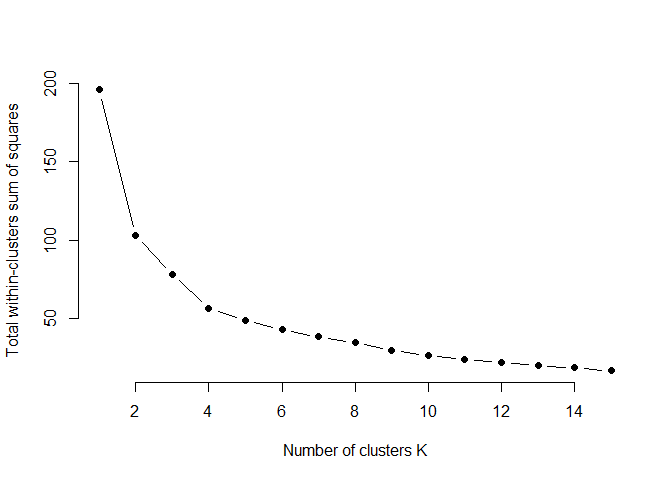
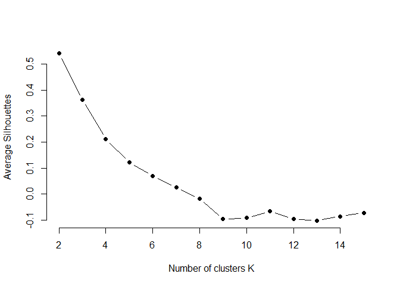
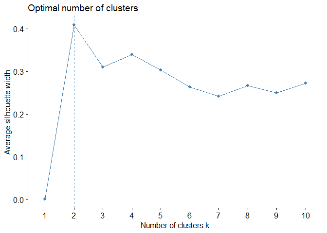
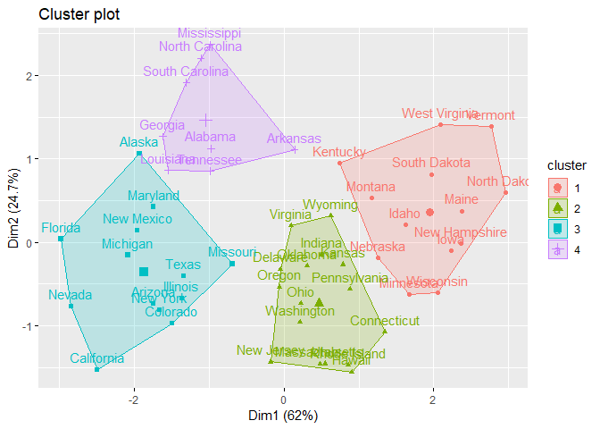

K-means Clustering
================
Muhammad Apriandito
5/21/2019

## K-means Cluster Analysis

Clustering adalah serangkaian teknik untuk menemukan sub-kelompok dalam
suatu set data. Clustering memungkinkan kita untuk mengidentifikasi
sub-kelompok yang sama, dan kemunkinan dapat dikategorikan.

K-means clustering adalah metode pengelompokan yang paling sederhana dan
umum digunakan untuk memisahkan dataset ke dalam sekumpulan sub-kelompok
(K).

## Library

Untuk membuat K-Means Clusterering di R, ada beberapa package yang
dibutuhkan diantaranya package “tidyverse”, “cluster”, dan “factoextra”.

tidyverse -\> Data Manipulation cluster -\> Clustering Algorithms
factoextra -\> Clustering algorithms & visualization

``` r
# Panggil library yang diperlukan
library(tidyverse)
```

    ## Warning: package 'tidyverse' was built under R version 3.5.3

    ## -- Attaching packages ------------------------------------------------------------------------ tidyverse 1.2.1 --

    ## v ggplot2 3.1.1     v purrr   0.3.2
    ## v tibble  2.1.1     v dplyr   0.8.1
    ## v tidyr   0.8.3     v stringr 1.4.0
    ## v readr   1.3.1     v forcats 0.4.0

    ## Warning: package 'ggplot2' was built under R version 3.5.3

    ## Warning: package 'tibble' was built under R version 3.5.3

    ## Warning: package 'tidyr' was built under R version 3.5.3

    ## Warning: package 'readr' was built under R version 3.5.3

    ## Warning: package 'purrr' was built under R version 3.5.3

    ## Warning: package 'dplyr' was built under R version 3.5.3

    ## Warning: package 'stringr' was built under R version 3.5.3

    ## Warning: package 'forcats' was built under R version 3.5.3

    ## -- Conflicts --------------------------------------------------------------------------- tidyverse_conflicts() --
    ## x dplyr::filter() masks stats::filter()
    ## x dplyr::lag()    masks stats::lag()

``` r
library(cluster)
library(factoextra)
```

    ## Warning: package 'factoextra' was built under R version 3.5.3

    ## Welcome! Related Books: `Practical Guide To Cluster Analysis in R` at https://goo.gl/13EFCZ

## Data Preparation

Umumnya, dalam melakukan Cluster Analysis. Beberapa tahapan data
pre-procssing yang perlu dilakukan :

1.  Menghapus/Mengolah Data Hilang
2.  Normalisasi/Normalisasi

Dalam praktek kali ini kita akan menggunakan dataset bawaan R yaitu
“USArrests”. yang merupakan dataset menganai tingkat kejahatan di 50
Negara Bagian Amerika Serikat pada tahun 1973.

``` r
#Memanggil dataset
df <- USArrests #nama data terkadang panjang. maka bisa disingkat df.

#Melihat Dimensi Data dim()
dim(df)
```

    ## [1] 50  4

``` r
#Melihat 10 Baris Pertama mnggunakan fungsi head
head(USArrests)
```

    ##            Murder Assault UrbanPop Rape
    ## Alabama      13.2     236       58 21.2
    ## Alaska       10.0     263       48 44.5
    ## Arizona       8.1     294       80 31.0
    ## Arkansas      8.8     190       50 19.5
    ## California    9.0     276       91 40.6
    ## Colorado      7.9     204       78 38.7

``` r
#Mengecek apakah ada Data Kosong (N/A) dalam data. 
sum(is.na(df))
```

    ## [1] 0

Dapat dilihat bahwa tidak ada data kosong didalam dataset tersebut,
sehingga tidak perlu adanya langkah lebih lanjut terkait data kosong.

Selanjutnya, untuk membuat semua feature dalam dataset memliki skala
yang sama (0-1) kita perlu melalukan standarisasi / penyetaraan skala.
Standarisasi dapat dilakukan menggunkan fungsi
“scale()”.

``` r
#Lakukan Standarisasi dan assign ke variable baru dengan nama "dfnorm".  
dfnorm <- scale(df) #scale berfungsi untuk standarisasi semua atribut
```

Mari kita cek data kita, setelah dilakukan normalisasi:

``` r
#Melihat 10 data teratas pada dataset yang telah dinormalisasi
head(dfnorm, 10)
```

    ##                  Murder    Assault   UrbanPop         Rape
    ## Alabama      1.24256408  0.7828393 -0.5209066 -0.003416473
    ## Alaska       0.50786248  1.1068225 -1.2117642  2.484202941
    ## Arizona      0.07163341  1.4788032  0.9989801  1.042878388
    ## Arkansas     0.23234938  0.2308680 -1.0735927 -0.184916602
    ## California   0.27826823  1.2628144  1.7589234  2.067820292
    ## Colorado     0.02571456  0.3988593  0.8608085  1.864967207
    ## Connecticut -1.03041900 -0.7290821  0.7917228 -1.081740768
    ## Delaware    -0.43347395  0.8068381  0.4462940 -0.579946294
    ## Florida      1.74767144  1.9707777  0.9989801  1.138966691
    ## Georgia      2.20685994  0.4828549 -0.3827351  0.487701523

## Clustering Distance Measures

Pemilihan Disctance Measures merupakan tahapan penting dalam clustering,
karena akan berpengaruh pada hasil/bentuk clustering. Beberapa distance
measures yang umum digunakan adalah Euclidean and Manhattan
distances.Pada praktek kali ini kita akan menggunakan Euclidean distance
sebagai distance measures.

Dalam R, untuk menghitung dan memvisualisasikan distance matrix, kita
dapat menggunakan fungsi “get\_dist()” dan “fviz\_dist()”. Di
visualisasi ini kita akan menggunakan Warna merah untuk menunjukkan
adanya perbedaan dan warna biru mennujukkan adanya persamaan/Kemiripan.

Keterangan Fungsi: - get\_dist: untuk menghitung distance matrix antar
raw. Default: Euclidean Distance - fviz\_dist: untuk memvisualisasi
distance matrix.

``` r
#Menhitung Ditance Matrix menggunakan fungsi get_distance()
distance <- get_dist(dfnorm, method = "euclidean" ) #method bisa euclidean dan manhattan

#Memvisualisasikan Distance Matrix menggunakan fungsi fviz_dist()
fviz_dist(distance, gradient = list(low = "#00AFBB", mid = "white", high = "#FC4E07"))
```

<!-- -->

\#Computing k-means clustering in R Kita dapat menghitung k-means dalam
R dengan fungsi “kmeans”. kali ini kita akan mengelompokkan data menjadi
dua kelompok (centers = 2).

Fungsi kmeans juga memiliki opsi nstart yang mencoba beberapa
konfigurasi awal dan menginformasikan yang terbaik. Contohnya,
menambahkan nilai nstart = 25 akan menghasilkan 25 konfigurasi
awal.

``` r
#Membuat Model K-Means Klustering dengan Jumlah K/Centers =2, nstart = 25, dengan nama K2
k2 <- kmeans(dfnorm, centers = 2, nstart = 25) #fungsi nstart dalam k-means di
str(k2)
```

    ## List of 9
    ##  $ cluster     : Named int [1:50] 2 2 2 1 2 2 1 1 2 2 ...
    ##   ..- attr(*, "names")= chr [1:50] "Alabama" "Alaska" "Arizona" "Arkansas" ...
    ##  $ centers     : num [1:2, 1:4] -0.67 1.005 -0.676 1.014 -0.132 ...
    ##   ..- attr(*, "dimnames")=List of 2
    ##   .. ..$ : chr [1:2] "1" "2"
    ##   .. ..$ : chr [1:4] "Murder" "Assault" "UrbanPop" "Rape"
    ##  $ totss       : num 196
    ##  $ withinss    : num [1:2] 56.1 46.7
    ##  $ tot.withinss: num 103
    ##  $ betweenss   : num 93.1
    ##  $ size        : int [1:2] 30 20
    ##  $ iter        : int 1
    ##  $ ifault      : int 0
    ##  - attr(*, "class")= chr "kmeans"

Keterangan: 1.cluster -\> Sebuah vektor bilangan bulat (dari 1: k) yang
menunjukkan cluster yang dialokasikan setiap titik. 2.center-\> pusat
dari matrix cluster. 3.totss -\> total sum of squares. 4.withinss -\>
Vektor jumlah dalam-cluster kuadrat, satu komponen per cluster.
5.tot.withinss -\> Total within-cluster sum of squares,
i.e. sum(withinss). 6.betweenss -\> The between-cluster sum of squares,
i.e. \(totss-tot.withinss\). 7.size -\> Jumlah Point disetiap Cluster

Kita juga dapat memprint hasil kluster.

``` r
#Print Hasil Kluster
k2
```

    ## K-means clustering with 2 clusters of sizes 30, 20
    ## 
    ## Cluster means:
    ##      Murder    Assault   UrbanPop       Rape
    ## 1 -0.669956 -0.6758849 -0.1317235 -0.5646433
    ## 2  1.004934  1.0138274  0.1975853  0.8469650
    ## 
    ## Clustering vector:
    ##        Alabama         Alaska        Arizona       Arkansas     California 
    ##              2              2              2              1              2 
    ##       Colorado    Connecticut       Delaware        Florida        Georgia 
    ##              2              1              1              2              2 
    ##         Hawaii          Idaho       Illinois        Indiana           Iowa 
    ##              1              1              2              1              1 
    ##         Kansas       Kentucky      Louisiana          Maine       Maryland 
    ##              1              1              2              1              2 
    ##  Massachusetts       Michigan      Minnesota    Mississippi       Missouri 
    ##              1              2              1              2              2 
    ##        Montana       Nebraska         Nevada  New Hampshire     New Jersey 
    ##              1              1              2              1              1 
    ##     New Mexico       New York North Carolina   North Dakota           Ohio 
    ##              2              2              2              1              1 
    ##       Oklahoma         Oregon   Pennsylvania   Rhode Island South Carolina 
    ##              1              1              1              1              2 
    ##   South Dakota      Tennessee          Texas           Utah        Vermont 
    ##              1              2              2              1              1 
    ##       Virginia     Washington  West Virginia      Wisconsin        Wyoming 
    ##              1              1              1              1              1 
    ## 
    ## Within cluster sum of squares by cluster:
    ## [1] 56.11445 46.74796
    ##  (between_SS / total_SS =  47.5 %)
    ## 
    ## Available components:
    ## 
    ## [1] "cluster"      "centers"      "totss"        "withinss"    
    ## [5] "tot.withinss" "betweenss"    "size"         "iter"        
    ## [9] "ifault"

kita juga dapat melihat hasil dengan menggunakan “fviz\_cluster”. Ini
memberikan ilustrasi yang bagus tentang cluster.

``` r
# visualisasi kluster menggunakan fungsi fviz_cluster()
fviz_cluster(k2, data = dfnorm)
```

<!-- -->

Sebagai alternatif, kita dapat menggunakan scatter plots untuk
menggambarkan kelompok dibandingkan dengan variabel asli.

``` r
#Visualisasi ScatterPlots menggunakan ggplot2
dfnorm %>%
  as_tibble() %>%
  mutate(cluster = k2$cluster,
         state = row.names(USArrests)) %>%
  ggplot(aes(UrbanPop, Murder, color = factor(cluster), label = state)) +
  geom_text()
```

<!-- -->

Karena jumlah cluster (k) harus ditetapkan sebelum kita memulai
algoritma, seringkali menguntungkan untuk menggunakan beberapa nilai k
yang berbeda dan memeriksa perbedaan dalam hasil. Kita dapat menjalankan
proses yang sama untuk 3, 4, dan 5 cluster.

``` r
#Membuat Untuk kluster dengan masing-masing K =3.4.5
k3 <- kmeans(dfnorm, centers = 3, nstart = 25)
k4 <- kmeans(dfnorm, centers = 3, nstart = 25)
k5 <- kmeans(dfnorm, centers = 3, nstart = 25)

# Membuat Komparasi Plot
p1 <- fviz_cluster(k2, geom = "point", data = dfnorm) + ggtitle("k = 2")
p2 <- fviz_cluster(k2, geom = "point", data = dfnorm) + ggtitle("k = 2")
p3 <- fviz_cluster(k2, geom = "point", data = dfnorm) + ggtitle("k = 2")
p4 <- fviz_cluster(k2, geom = "point", data = dfnorm) + ggtitle("k = 2")

#install packages gridExtra
library(gridExtra) 
```

    ## Warning: package 'gridExtra' was built under R version 3.5.3

    ## 
    ## Attaching package: 'gridExtra'

    ## The following object is masked from 'package:dplyr':
    ## 
    ##     combine

``` r
grid.arrange(p1, p2, p3, p4, nrow = 2)
```

<!-- -->

\#\#Determining Optimal Clusters Untuk membantu analis, berikut ini
merupakan dua metode yang populer untuk menentukan nilai Optimal CLuter:
1. Elbow method 2. Silhouette method

\#Elbow Method

``` r
set.seed(123)

# function to compute total within-cluster sum of square 
wss <- function(k) {
  kmeans(dfnorm, k, nstart = 10 )$tot.withinss
}

# Compute and plot wss for k = 1 to k = 15
k.values <- 1:15

# extract wss for 2-15 clusters
wss_values <- map_dbl(k.values, wss)

plot(k.values, wss_values,
       type="b", pch = 19, frame = FALSE, 
       xlab="Number of clusters K",
       ylab="Total within-clusters sum of squares")
```

<!-- -->
Hasilnya menunjukkan bahwa 4 adalah jumlah cluster optimal karena berada
diposisi siku.

Kita dengan cepat dapat menghitung Elbow Method menggunakan fungsi
fviz\_nbclust()

``` r
#Visualisasi Elbow Method menggunakan fungsi fviz_nbclust()
fviz_nbclust(dfnorm, kmeans, method = "wss")
```

<!-- -->

``` r
#dalam elbow method yg paling deket siku yg paling bagus.
```

\#Average Silhouette Method Singkatnya, pendekatan siluet mengukur
kualitas pengelompokan. Artinya, menentukan seberapa baik setiap objek
terletak di dalam klusternya. Lebar siluet rata-rata yang tinggi
menunjukkan pengelompokan yang baik

Kita bisa menggunakan fungsi Silhouette dalam package cluster untuk
menghitung lebar Silhouette rata-rata. code berikut menghitung
pendekatan ini untuk 1-15 cluster. Hasilnya menunjukkan bahwa 2 klaster
memaksimalkan nilai rata-rata Silhouette dengan 4 klaster yang masuk
sebagai jumlah klaster optimal kedua.

``` r
# function to compute average silhouette for k clusters 
avg_sil <- function(k) {
  km.res <- kmeans(dfnorm, centers = k, nstart = 25)
  ss <- silhouette(km.res$cluster, dist(df))
  mean(ss[, 3])
}

# Compute and plot wss for k = 2 to k = 15
k.values <- 2:15

# extract avg silhouette for 2-15 clusters
avg_sil_values <- map_dbl(k.values, avg_sil)

plot(k.values, avg_sil_values,
       type = "b", pch = 19, frame = FALSE, 
       xlab = "Number of clusters K",
       ylab = "Average Silhouettes")
```

<!-- -->

Kita dengan cepat dapat menghitung Average Silhouette dalam satu fungsi
fviz\_nbclust.

``` r
#Visualisasi Average Silhoutte menggunakan fugsi fviz_nbclust()
fviz_nbclust(dfnorm, kmeans, method = "silhouette") #dalam silhouette yang paling bagus adalah yang paling tinggi yaitu dua. 
```

<!-- -->

\#Extracting Results Dengan sebagian besar pendekatan ini menyarankan 4
sebagai jumlah cluster optimal, kita dapat melakukan analisis akhir dan
mengekstraksi hasilnya menggunakan 4 cluster.

``` r
# Compute k-means clustering with k = 4
set.seed(123)
final <- kmeans(dfnorm, 4, nstart = 25)
print(final)
```

    ## K-means clustering with 4 clusters of sizes 13, 16, 13, 8
    ## 
    ## Cluster means:
    ##       Murder    Assault   UrbanPop        Rape
    ## 1 -0.9615407 -1.1066010 -0.9301069 -0.96676331
    ## 2 -0.4894375 -0.3826001  0.5758298 -0.26165379
    ## 3  0.6950701  1.0394414  0.7226370  1.27693964
    ## 4  1.4118898  0.8743346 -0.8145211  0.01927104
    ## 
    ## Clustering vector:
    ##        Alabama         Alaska        Arizona       Arkansas     California 
    ##              4              3              3              4              3 
    ##       Colorado    Connecticut       Delaware        Florida        Georgia 
    ##              3              2              2              3              4 
    ##         Hawaii          Idaho       Illinois        Indiana           Iowa 
    ##              2              1              3              2              1 
    ##         Kansas       Kentucky      Louisiana          Maine       Maryland 
    ##              2              1              4              1              3 
    ##  Massachusetts       Michigan      Minnesota    Mississippi       Missouri 
    ##              2              3              1              4              3 
    ##        Montana       Nebraska         Nevada  New Hampshire     New Jersey 
    ##              1              1              3              1              2 
    ##     New Mexico       New York North Carolina   North Dakota           Ohio 
    ##              3              3              4              1              2 
    ##       Oklahoma         Oregon   Pennsylvania   Rhode Island South Carolina 
    ##              2              2              2              2              4 
    ##   South Dakota      Tennessee          Texas           Utah        Vermont 
    ##              1              4              3              2              1 
    ##       Virginia     Washington  West Virginia      Wisconsin        Wyoming 
    ##              2              2              1              1              2 
    ## 
    ## Within cluster sum of squares by cluster:
    ## [1] 11.952463 16.212213 19.922437  8.316061
    ##  (between_SS / total_SS =  71.2 %)
    ## 
    ## Available components:
    ## 
    ## [1] "cluster"      "centers"      "totss"        "withinss"    
    ## [5] "tot.withinss" "betweenss"    "size"         "iter"        
    ## [9] "ifault"

kita dapat memvisualisasikan hasil menggunakan (fviz\_cluster)

``` r
# Visualisasi Final Cluster
fviz_cluster(final, data=dfnorm)
```

<!-- -->

Dan kita dapat mengekstrak cluster dan menambah data awal kita untuk
melakukan beberapa statistik deskriptif di tingkat cluster

``` r
USArrests %>%
  mutate(Cluster = final$cluster) %>%
  group_by(Cluster) %>%
  summarise_all("mean")
```

    ## # A tibble: 4 x 5
    ##   Cluster Murder Assault UrbanPop  Rape
    ##     <int>  <dbl>   <dbl>    <dbl> <dbl>
    ## 1       1   3.6     78.5     52.1  12.2
    ## 2       2   5.66   139.      73.9  18.8
    ## 3       3  10.8    257.      76    33.2
    ## 4       4  13.9    244.      53.8  21.4
